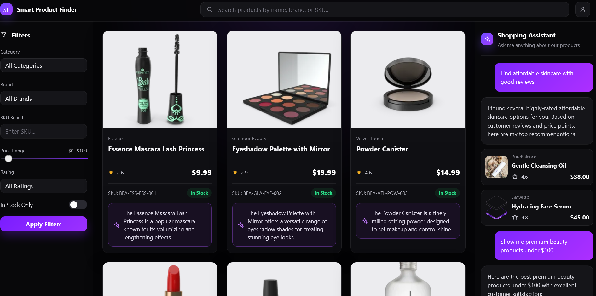

# AI Shopping Agent | BM25-Powered Ecommerce Assistant

A full-stack shopping assistant demo built with FastAPI, React, Vite, BM25 retrieval, and ChromaDB utilities.


This project combines:

- a searchable product catalog
- an AI shopping assistant
- BM25 retrieval-backed product lookup
- a responsive storefront UI for browsing products

It is designed as a portfolio project that focuses on product discovery and conversational shopping.

## What It Does

- Browse a product catalog in a responsive storefront
- Filter products by category, brand, SKU, rating, price, and stock
- Use the assistant to search for products and ask for product details
- Rank live chat product matches with BM25 lexical retrieval
- Store and retrieve product records with ChromaDB utilities

## Why This Exists

The goal of this project is to demonstrate a realistic shopping workflow with AI-assisted search.

It explores how BM25 lexical retrieval, structured metadata filtering, and conversational UI can work together to support product discovery.

## Tech Stack

- Frontend: React, TypeScript, Vite
- Backend: FastAPI, Python
- Product Retrieval: BM25 via `rank-bm25`
- Vector Utilities: ChromaDB with OpenAI embeddings
- AI / Assistant: OpenAI and assistant helpers
- Data Source: `data/products.json`

## Features

- Product grid with thumbnails, prices, ratings, SKUs, and stock status
- Sidebar filters for category, brand, SKU, rating, price, and stock
- Desktop assistant rail
- Mobile assistant drawer
- Backend catalog API
- BM25 product retrieval for assistant chat
- ChromaDB-based product ingestion and retrieval utilities

## Screenshot



## Project Structure

```text
shopping_agent/
  backend/
    app.py
    agent/
      intent.py
      retrieval.py
      responses.py
    tools.py
    RAG/
      embed_products.py
      search.py
      shopping_agent.py
      debug/
  frontend/
    my-app/
  data/
    products.json
    fetch_products.py
  chroma_db/
  ideas/
    screen_shot.png
  README.md
```

## Setup

### Backend

From the repo root:

```powershell
.\.venv\Scripts\Activate.ps1
uvicorn backend.app:app --reload --port 8010
```

The backend runs at `http://localhost:8010`.

### Backend Docker

Build and run the backend container from the repo root:

```bash
docker build -t shopping-agent-backend .
docker run --env-file .env -p 8010:8010 shopping-agent-backend
```

The container exposes the FastAPI app on `http://localhost:8010`.

For Render, create a Web Service from this repo using the root `Dockerfile`. Add `OPENAI_API_KEY` as a Render environment variable, and let Render provide the `PORT` value. If uploaded products or ChromaDB data need to survive redeploys, attach persistent storage for `/app/backend/uploads` and `/app/chroma_db`.

### Frontend

In a second terminal:

```bash
cd frontend/my-app
npm install
npm run dev
```

The frontend usually runs at `http://localhost:5173`.

For Vercel, deploy `frontend/my-app` and set `VITE_API_BASE_URL` to the Render backend URL.

## Environment Variables

Create a `.env` file for backend secrets:

```env
OPENAI_API_KEY=your_api_key_here
```

The backend uses this for embedding and retrieval-related workflows.

## Data Source

Product data, descriptions, and images were seeded from DummyJSON for demo purposes.

## API Endpoints

### Health

- `GET /health` - backend health check

### Products

- `GET /products` - return the product catalog
- `POST /products` - create a product
- `POST /products/upload` - sync uploaded catalog data into the backend and ChromaDB
- `GET /uploads/{filename}` - serve uploaded product images

### Chat

- `POST /chat` - assistant endpoint returning structured product search responses ranked with BM25 retrieval

## Backend Notes

The backend supports:

- greeting detection
- BM25 product search and ranking
- exact SKU lookup
- topic guarding for off-topic questions
- structured responses for the frontend
- assistant intent logic in `backend/agent/intent.py`
- BM25 retrieval logic in `backend/agent/retrieval.py`
- assistant response building in `backend/agent/responses.py`
- keeping the route layer lean so assistant logic is isolated and easier to tune
- making future prompt and token optimization work easier by separating intent checks from response shaping

The live `/chat` endpoint uses BM25 for product retrieval. The RAG scripts in `backend/RAG/` and the local `chroma_db/` folder remain available for ChromaDB ingestion, exact metadata lookup, vector search experiments, and debugging.

## Frontend Notes

The frontend fetches products from the backend and renders:

- product cards
- filter controls
- assistant panel
- mobile assistant drawer

The assistant panel sends messages to the backend chat endpoint and renders the returned product matches in the UI.

## Development Notes

- Run the backend and frontend in separate terminals.
- If products are not showing up, confirm the backend is running and `GET /products` returns data.
- Furniture items in the dataset are above the default `$100` price cap, so raise the price filter if you want to see them in the UI.
- The chat endpoint ranks product matches with BM25 from `backend/agent/retrieval.py`.
- The repo uses a local `chroma_db/` folder for persisted vector storage utilities.

## Future Improvements

- Conversation memory
- Product comparison
- Streaming assistant responses
- Voice and image search
- Saved favorites and user accounts

## Troubleshooting

### Products are not loading

- Make sure `uvicorn backend.app:app --reload --port 8010` is running
- Confirm `http://localhost:8010/products` returns JSON
- Check the browser console for fetch errors

### Assistant button does not respond

- Make sure the frontend dev server is running
- Confirm the chat endpoint exists and the frontend is sending requests to `http://localhost:8010/chat`

### Furniture does not appear

- Increase the price range above `$100`
- Furniture products in this dataset are priced above that cutoff

## License

This project is for portfolio and demo use.
